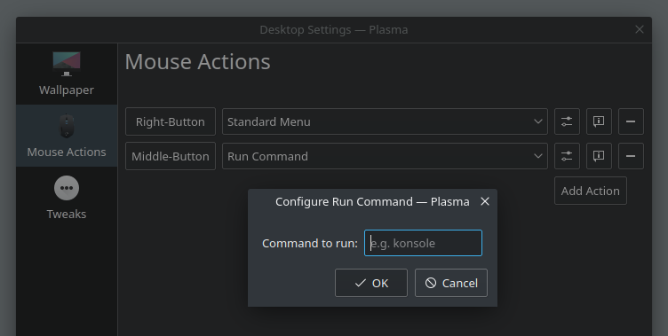

# Plasma Desktop Run Command

This is a simple plugin for the KDE Plasma desktop which allows running a custom command, by invoking a specified mouse action on the desktop area. To give you an example, such feature may be useful if you want to run third-party application launchers, like [jgmenu](https://github.com/johanmalm/jgmenu), or if you want to quickly spawn terminal windows with a mouse button click.

## Screenshot



## Installation
In order to compile the plugin, you need to have CMake and Extra CMake Modules installed. The plugin depends on Qt, KF5 and KIO development libraries. Find and install required packages by yourself, as they differ between distributions.

To build the plugin, use following commands:

```
mkdir build
cd build
cmake ..
make
```

Then, use `sudo make install` to install the plugin.

If you want to uninstall the plugin, use `sudo make uninstall`.
